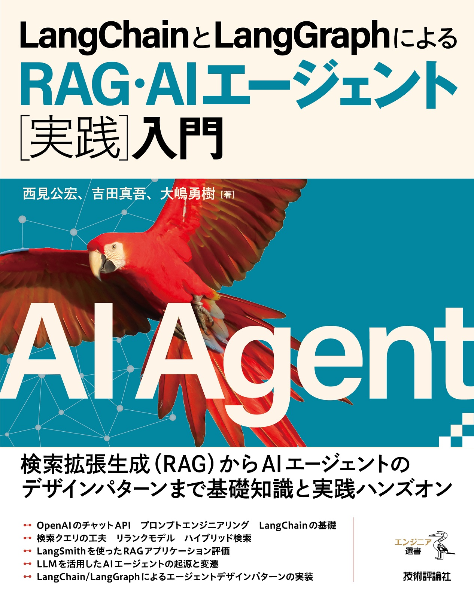

# Agent Book

<center>



</center>

## Description

書籍「[LangChain と LangGraph による RAG・AI エージェント［実践］入門](https://gihyo.jp/book/2024/978-4-297-14530-9)」の実装

## How to use

### 1. uv のインストール

uv がインストールされていない場合は、以下のコマンドでインストールしてください：

```bash
curl -LsSf https://astral.sh/uv/install.sh | sh
```

### 2. 依存関係のインストール

プロジェクトのルートディレクトリで以下のコマンドを実行し、必要なパッケージをインストールします：

```bash
uv sync
```
